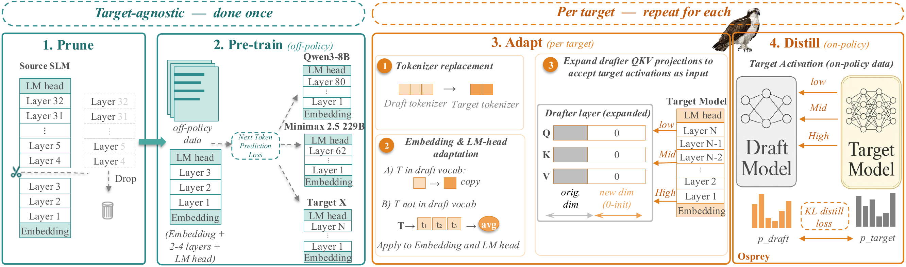
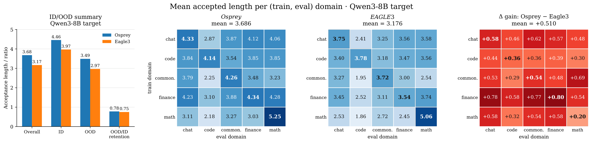

# Osprey

Code for **Osprey: Target-agnostic Pre-training Makes Stronger Drafters in
Speculative Decoding**.

Speculative drafters are usually trained from scratch against one target model
on one data distribution, and their acceptance rate collapses when the serving
workload shifts. Osprey instead bootstraps a drafter from an off-the-shelf
pretrained small language model: prune it to a shallow backbone, restore its
language modeling with target-agnostic next-token pretraining, and then adapt
that single backbone to each target through vocabulary alignment,
zero-initialized QKV expansion, and EAGLE-3 distillation.

<p align="center">
  
</p>

The pipeline has four stages. **This repository implements Stages 3 and 4**, the
per-target half:

| Stage | What it does | Where |
| --- | --- | --- |
| 1. Prune | Keep the embedding, LM head, and first N blocks of a small LM | released separately |
| 2. Pre-train | Next-token prediction on FineWeb, producing one reusable backbone | released separately |
| **3. Adapt** | Align tokenizer/vocabulary, expand QKV with zero-init taps | `scripts/osprey/convert_checkpoint.py` |
| **4. Distill** | On-policy EAGLE-3 distillation against the frozen target | `scripts/osprey/run_adaptation.py` |

Stages 1–2 are target-agnostic and run once, so this release starts from their
output checkpoint. Three targets are reproduced: **`Qwen/Qwen3-8B`** (the
five-domain cross-domain matrix, Figure 2, and the ablations in Tables 4–7),
**`meta-llama/Llama-3.3-70B-Instruct`** (Table 1), and **`MiniMaxAI/MiniMax-M2.5`**,
a 229B FP8 MoE (Tables 2–3).

Everything needed to run or reproduce them is on Hugging Face at
[`BobbieBieee/Osprey-Speculative-Decoding`](https://huggingface.co/BobbieBieee/Osprey-Speculative-Decoding):
the seven adapted drafters, the Stage-2 backbone they all start from, and the
five evaluation splits.

## Built on SpecForge

Osprey builds on [SpecForge](https://github.com/sgl-project/SpecForge), keeping
its EAGLE-3 training loop, FSDP execution, and SGLang serving interfaces, and
adding the multi-layer warm-start drafter, the conversion pipeline, the
per-target presets, and the paper's evaluation suites. Everything the paper does
not use has been removed; see
[the SpecForge docs](https://docs.sglang.ai/SpecForge/) for the rest.

---

## Installation

Requires Python 3.11 and NVIDIA GPUs. `torch`, `transformers` and `sglang` are
version-pinned in `pyproject.toml`; the rest float.

### 1. Create the environment

```bash
conda create -y -n osprey python=3.11
conda activate osprey
```

### 2. Install the project

Two stages, in this order — `flash-attn`'s `setup.py` imports `torch`, so the
`[fa]` extra cannot go into an empty environment:

```bash
pip install --upgrade pip
pip install .                                            # base deps, incl. torch
MAX_JOBS=8 pip install -v ".[fa]" --no-build-isolation    # flash-attn (optional)
```

`[fa]` is optional and takes 10–20 minutes to build; without it the draft falls
back to `flex_attention`, which is the backend this workflow uses anyway.

Use `pip install -e .` if you intend to edit `specforge/` — a plain
`pip install .` puts a copy in `site-packages` that the `scripts/` entrypoints
import instead of your working tree. Do not mix the two.

### 3. Patch SGLang — required for evaluation

Stock SGLang serves only single-layer `LlamaForCausalLMEagle3` drafts and
overwrites the draft's embedding with the target's at load time. An Osprey
drafter breaks both: it is 2 or 4 layers deep and owns a tokenizer-aligned
embedding that must survive loading.

```bash
bash sglang_patches/apply_patch.sh --check    # dry run, writes nothing
bash sglang_patches/apply_patch.sh            # apply in place
```

Training does not use SGLang's draft path and works unpatched. Every change is
gated on a config flag only Osprey checkpoints set, so serving any other draft
is byte-identical either way. See
[`sglang_patches/README.md`](sglang_patches/README.md) to revert.

> **If accepted length comes out near 1.0** for a checkpoint that trained to
> much higher, the usual cause is an unpatched SGLang: the draft loaded, but
> silently ran with the target's embedding and only its first layer.

### 4. Verify

```bash
python -c "import specforge; print('specforge ok')"
python -c "from sglang.srt.models.qwen3_eagle3 import Qwen3ForCausalLMEagle3; print('sglang patch ok')"
PYTHONPATH=$PWD python -m unittest discover -s tests -p "test_*.py"
```

39 tests, no GPU required; 2 skip without the `[fa]` extra. For an end-to-end
check that also exercises the SGLang target backend, `examples/run_smoke_test.sh`
trains one epoch on the committed `data/train.small.jsonl` (2 GPUs, a few
minutes; the result is not a usable drafter).

---

## Quick start: serve a released drafter

Download one drafter and point SGLang at it. The target is fetched from the Hub
on first launch.

```bash
huggingface-cli download BobbieBieee/Osprey-Speculative-Decoding \
  --include "qwen3-8b/osprey-chat/*" --local-dir osprey

python -m sglang.launch_server \
  --model-path Qwen/Qwen3-8B \
  --speculative-algorithm EAGLE3 \
  --speculative-draft-model-path osprey/qwen3-8b/osprey-chat \
  --speculative-num-steps 5 --speculative-eagle-topk 1 --speculative-num-draft-tokens 6 \
  --tp-size 1 --dtype bfloat16 --mem-fraction-static 0.8 --port 30000
```

The other two targets take the same command with a different drafter and target:

| Drafter | `--model-path` | Extra flags |
| --- | --- | --- |
| `llama33-70b/osprey` | `meta-llama/Llama-3.3-70B-Instruct` | `--tp-size 4` |
| `minimax-m25/osprey` | `MiniMaxAI/MiniMax-M2.5` | `--tp-size 4 --ep-size 4 --trust-remote-code --disable-custom-all-reduce --mem-fraction-static 0.85` |

Then talk to it through the OpenAI-compatible endpoint; the server applies the
target's own chat template:

```bash
curl -s http://127.0.0.1:30000/v1/chat/completions -H 'Content-Type: application/json' -d '{
  "model": "Qwen/Qwen3-8B",
  "messages": [{"role": "user", "content": "Write a haiku about speculative decoding."}],
  "max_tokens": 128, "temperature": 0
}'
```

The server log prints `accept len:` for every decode step. If it sits near 1.0,
SGLang is unpatched (Installation step 3).

---

## Inputs

### Environment variables used by the launch scripts

```bash
export OSPREY_DATA=/path/to/data          # domain train/eval JSONLs
export OSPREY_OUTPUT=/path/to/output      # checkpoints and results
export OSPREY_DRAFT_INIT=/path/to/converted-drafter
```

### The pretrained backbone (Stage 2 output)

Either of the two backbones from the paper:

| Backbone | Source model | Layers kept | Body params | `--architecture` |
| --- | --- | --- | --- | --- |
| Qwen3-4B 2-layer | `Qwen/Qwen3-4B` (36 layers) | 2 | 265 M | `qwen3` |
| LayerSkip-Llama 4-layer | `facebook/layerskip-llama3.2-1B` (16 layers) | 4 | 294 M | `layerskip` |

The Qwen3-4B 2-layer backbone produces the headline results and is released:

```bash
huggingface-cli download BobbieBieee/Osprey-Speculative-Decoding \
  --include "pretrained/qwen3-4b-2layer-fineweb-55k/*" --local-dir osprey
```

Both backbones are target-agnostic: the same checkpoint is converted once per
target.

### Training and evaluation data

The Qwen3-8B study uses five single-domain splits, each 65k examples whose
assistant turns were regenerated by the target itself, plus a 512-example
held-out slice per domain:

```
{chat,code,commonsense,finance,math}_train_65k_qwen3_8B_4096.jsonl
{chat,code,commonsense,finance,math}_eval_512_qwen3_8B_4096.jsonl
```

Every record is `{"id": str, "conversations": [{"role", "content"}, ...]}`.

The five evaluation splits are released (15 MB); the evaluation scripts read
them from `$OSPREY_DATA`:

```bash
huggingface-cli download BobbieBieee/Osprey-Speculative-Decoding \
  --include "data/*" --local-dir osprey
export OSPREY_DATA=$PWD/osprey/data
```

The training splits are not released. To build them yourself, start from prompt-side JSONL in the same schema —
`data/convert_dataset.py` converts a HuggingFace or ShareGPT-style dataset into
it — and regenerate the assistant turns with the target.
`scripts/osprey/regenerate_data.sh` launches a pool of SGLang servers and
streams the file through them:

```bash
for domain in chat code commonsense finance math; do
  INPUT_FILE="$OSPREY_DATA/${domain}_prompts.jsonl" \
  OUTPUT_FILE="$OSPREY_DATA/${domain}_train_65k_qwen3_8B_4096.jsonl" \
  MODEL=Qwen/Qwen3-8B MAX_TOKENS=4096 \
    bash scripts/osprey/regenerate_data.sh
done
```

For MiniMax-M2.5 the paper adapts on a single code split regenerated by that
target — same script with `MODEL=MiniMaxAI/MiniMax-M2.5 TP_SIZE=4
REASONING_PARSER=minimax-append-think`.

---

## Qwen3-8B: the cross-domain matrix

Reproduces the Osprey half of Figure 2: one drafter per training domain, each
evaluated on all five domains.

Hardware: 2×H100 80GB for adaptation, 1×H100 for evaluation.

### Stage 3 — convert

```bash
python scripts/osprey/convert_checkpoint.py \
  --architecture qwen3 --target qwen3-8b \
  --source-checkpoint osprey/pretrained/qwen3-4b-2layer-fineweb-55k \
  --output-dir "$OSPREY_OUTPUT/qwen3-2l-init"
```

This keeps the first 2 transformer blocks, widens every Q/K/V projection to
`2 * hidden_size` with the pretrained weights on the hidden-state half and
**zeros** on the new target-feature columns, sets `fc` to the identity on the
deepest tapped target layer, and remaps the embedding and LM-head rows into
Qwen3-8B's vocabulary. The zero Q/K/V half is the point: at initialization the
target features contribute nothing, so the drafter computes exactly what the
backbone computed and adaptation starts from a working language model rather
than from noise. `fc` is deliberately *not* zero — a zero `fc` behind a zero
Q/K/V half is a stationary point where neither ever receives gradient. Mapping
statistics land in `tokenizer_alignment.json`. Run on the released backbone this
reproduces the paper's Stage-3 output bit for bit.

Use `--architecture layerskip` for the 4-layer LayerSkip backbone; it keeps 4
blocks and writes a `LlamaForCausalLMEagle3` config instead.

This step needs the Stage-2 backbone. If you were given an already-converted
drafter instead, point `OSPREY_DRAFT_INIT` at it and go straight to Stage 4 —
the converted directory is the only thing Stage 4 consumes.

### Stage 4 — adapt

One run per training domain. All five fill the rows of the matrix:

```bash
export OSPREY_DRAFT_INIT="$OSPREY_OUTPUT/qwen3-2l-init"
bash examples/run_osprey_qwen3_8b_adaptation.sh
```

Defaults are the paper's — `Qwen/Qwen3-8B` served in-process by SGLang at tp=1,
lr 1e-4, 3 epochs, sequence length 4096, TTT length 5, warmup 0.04,
`qwen3-thinking` template, `flex_attention` — and live in
`scripts/osprey/run_adaptation.py` so the launch script cannot drift from the
trainer. With the default 2 GPUs, 65k × 3 epochs gives the paper's 97,500 steps;
changing `NUM_GPUS` changes the step count.

Checkpoints land in `$OSPREY_OUTPUT/qwen3-8b/osprey/<domain>/epoch_*_step_*`.
`DRY_RUN=1` prints each `torchrun` command without launching; `OSPREY_DOMAINS`
selects a subset.

The script walks its domains sequentially. With more GPUs, train them
concurrently — one invocation per domain, each with its own GPU pair and
tokenizer cache. `torchrun --standalone` binds a free rendezvous port per job,
so the launches do not collide:

```bash
gpu=0
for domain in chat code commonsense finance; do
  CUDA_VISIBLE_DEVICES=$gpu,$((gpu + 1)) \
  OSPREY_DOMAINS="$domain" \
  OSPREY_CACHE_DIR="$OSPREY_OUTPUT/cache/$domain" \
    bash examples/run_osprey_qwen3_8b_adaptation.sh 2 \
      > "$OSPREY_OUTPUT/logs/train-$domain.log" 2>&1 &
  gpu=$((gpu + 2))
done
wait
```

Each job holds the Qwen3-8B target plus the FSDP draft, so budget a full 80 GB
GPU pair per domain and check with `nvidia-smi` that they are free — an occupied
GPU OOMs at target load rather than queueing.

#### Disk

At the default `SAVE_INTERVAL=5000` a run writes 20 checkpoints of ~6 GB, so
**budget ~120 GB per domain**. Raise the interval if that is too much; the final
step is always saved, and that is the checkpoint you evaluate.

Training also writes outside `--output-dir`, and all of these need room:

| what | where | override |
| --- | --- | --- |
| checkpoints, logs | `$OSPREY_OUTPUT` | the launch command |
| tokenized dataset | `$OSPREY_CACHE_DIR` | env |
| HF `Dataset.from_generator` cache | `$HF_HOME/datasets` | `HF_DATASETS_CACHE` |
| DataLoader fd-sharing sockets | `$TMPDIR` | `TMPDIR` |
| compiled flex-attention kernels | `<repo>/cache/compiled_kernels` | `TORCHINDUCTOR_CACHE_DIR`, `TRITON_CACHE_DIR` |

If the filesystem fills, the job dies **with no error in its log** — the log
write is what fails. On a shared volume, redirect all five before launching:

```bash
export OSPREY_OUTPUT=/big/disk/osprey-out
export HF_DATASETS_CACHE=/big/disk/hf-datasets
export TMPDIR=/big/disk/tmp
export TORCHINDUCTOR_CACHE_DIR=/big/disk/inductor
export TRITON_CACHE_DIR=/big/disk/triton
```

Never clear `$TMPDIR` while a run is live: the DataLoader passes tensors between
processes over a Unix socket there, and deleting it kills every rank with a bare
`FileNotFoundError` from `rebuild_storage_fd`.

Two startup messages look like failures and are not: SGLang's
`Ignore import error when loading sglang.srt.models.*` (it walks its whole model
registry at import), and an `OSError: [Errno 16] ... '.nfs...'` traceback right
after `Map (num_proc=8): 100%` (`multiprocess` cleaning up its temp dir on NFS,
*after* tokenization succeeded). The first few minutes are also CPU-bound, so
the target sits at 0% utilization until the log prints `train step N | acc ...`.

### Evaluate

```bash
bash examples/run_osprey_qwen3_8b_eval.sh \
  "$OSPREY_OUTPUT/qwen3-8b/osprey/math/epoch_2_step_97500"
```

Each run measures one drafter on all five domains — one row of the matrix. Run
it for all five checkpoints to fill the 5×5 grid. Rows are independent, so give
each its own GPU and its own port to fill the grid in parallel:

```bash
gpu=0
for domain in chat code commonsense finance math; do
  CUDA_VISIBLE_DEVICES=$gpu PORT=$((30000 + gpu)) \
  RESULT_NAME="osprey-$domain" \
    bash examples/run_osprey_qwen3_8b_eval.sh \
      "$OSPREY_OUTPUT/qwen3-8b/osprey/$domain/epoch_2_step_97500" \
      > "logs/osprey-$domain.log" 2>&1 &
  gpu=$((gpu + 1))
done
wait
```

Serving configuration is the paper's: `(batch, steps, topk, draft_tokens) =
(1, 5, 1, 6)`, `max_tokens` 4096, greedy, tp=1. Results go to
`$OSPREY_OUTPUT/results/osprey-<domain>/` as a JSON with per-request detail and
a flat `summary_*.csv`.

The filled grid is the left matrix of the paper's headline figure:

<p align="center">
  
</p>

<p align="center">
  <em>Figure 2: accepted length for every train/eval domain pair. Osprey beats
  the from-scratch EAGLE-3 baseline in all 25 cells, by more out of domain
  (+0.52) than in domain (+0.49).</em>
</p>

Every cell uses the **whole 512-prompt eval split** (`NUM_PROMPTS`, default
512). Lowering it makes a cell *biased*, not merely noisy: the benchmarker takes
the **first N records**, not a random sample, and the files are not shuffled
(the first 64 finance records average 17% of the full split's answer length, and
short generations accept better). The same checkpoint on commonsense reads 4.70
at 32 prompts, 4.56 at 64, 4.34 at 512 — a 0.44 overstatement, larger than the
gain the paper reports. Subsample to debug a configuration, then re-run at 512
before quoting anything.

**Accepted length is averaged per request** — `mean(tokens/verify_ct)`, not a
corpus-level ratio. Greedy decoding makes it deterministic, so a cell re-runs
exactly. Throughput is not: eight parallel evaluations on one node shifted
`tok/s` by 2-3%, so treat throughput as same-machine-only.

---

## Llama-3.3-70B-Instruct

Reproduces the Osprey column of Table 1. The released drafter was adapted for
37.5k steps on target-regenerated Open-PerfectBlend from the same Qwen3-4B
backbone. Evaluate it on the five domains with the Qwen3-8B script — the
benchmarks read only the prompts, so the splits are target-independent — at
tp=4:

```bash
OSPREY_TARGET_MODEL=meta-llama/Llama-3.3-70B-Instruct TP_SIZE=4 \
  bash examples/run_osprey_qwen3_8b_eval.sh osprey/llama33-70b/osprey
```

Adaptation for this target uses the Stage-3/4 recipe above with
`--target-hidden-size 8192`; a `llama33-70b` preset is not shipped in this
release.

---

## MiniMax-M2.5: cross-target scaling

Reproduces Table 2 (public benchmarks) and Table 3 (multilingual). Starting from
the *same* Qwen3-4B backbone, only Stages 3 and 4 are repeated — that reuse is
the paper's central systems claim.

Hardware: the paper uses 4×B200 for both adaptation and serving, with the FP8
target at tp=4, ep=4. It also runs on an 8×H100 node; raise `NUM_GPUS` and keep
`TP_SIZE=4`.

### Convert and adapt

```bash
python scripts/osprey/convert_checkpoint.py \
  --architecture qwen3 --target minimax-m25 \
  --source-checkpoint /path/to/qwen3-4b-2layer-backbone \
  --output-dir "$OSPREY_OUTPUT/qwen3-2l-init-minimax"
```

The `minimax-m25` preset carries the target interface: hidden size 3072, tapped
layers 1/30/58 of 62, and the 200,064-token MiniMax vocabulary. Roughly half the
drafter's rows map to an exact token and the rest are averages of sub-token rows,
which is why the embedding stays trainable during adaptation.

```bash
export OSPREY_DRAFT_INIT="$OSPREY_OUTPUT/qwen3-2l-init-minimax"
export OSPREY_MINIMAX_DATA=/path/to/code_train_minimax_m25.jsonl
bash examples/run_osprey_minimax_m25_adaptation.sh
```

On Hopper pass `SGLANG_ATTN_BACKEND=fa3`; the default `flashinfer` is what
Blackwell needs.

### Evaluate

```bash
CKPT=osprey/minimax-m25/osprey        # or your own $OSPREY_OUTPUT/minimax-m25/osprey/code/epoch_*_step_35000

# Table 2: HumanEval, MATH-500, LiveCodeBench, MT-Bench, Commonsense-Eval
bash examples/run_osprey_minimax_m25_eval.sh "$CKPT" public

# Table 3: MGSM (11 languages), Global-MMLU (42 languages), and the
# native-output variant that forces replies in the question's language
bash examples/run_osprey_minimax_m25_eval.sh "$CKPT" multilingual

# both
bash examples/run_osprey_minimax_m25_eval.sh "$CKPT"
```

This script launches SGLang itself, because an FP8 MoE target needs server flags
(`--ep-size`, `--disable-custom-all-reduce`) that the benchmark runner does not
forward, then drives it with `--skip-launch-server`. Serving configuration
matches Qwen3-8B: `(1, 5, 1, 6)` at `max_tokens` 4096, greedy.

MGSM and Global-MMLU are downloaded from `juletxara/mgsm` and
`CohereLabs/Global-MMLU` on first use, and are sampled round-robin across
languages so a small prompt count still covers every language.

---

## Repository layout

```
scripts/osprey/         Stage 3 and Stage 4 entrypoints, and data regeneration
  convert_checkpoint.py   prune + QKV expansion + tokenizer alignment
  align_tokenizer.py      vocabulary transfer (called by the above)
  run_adaptation.py       the paper's hyperparameters, per target
  regenerate_data.sh      on-policy data generation with a pool of SGLang servers
scripts/                convert_{qwen3,llama}_to_eagle3_preserve_layers.py do the
                        weight surgery; train_eagle3.py is the training loop
specforge/              the library: TTT loss (core/), draft models (modeling/draft/),
                        the SGLang target backend (modeling/target/), data pipeline
benchmarks/             bench_eagle3.py plus one adapter per benchmark
examples/               launch scripts for every table in the paper
sglang_patches/         the SGLang patch required to serve an Osprey drafter
tests/                  unit tests; test_osprey_release.py guards the invariants
```

## Citation

```bibtex
@inproceedings{osprey,
  title     = {Osprey: Target-agnostic Pre-training Makes Stronger Drafters in
               Speculative Decoding},
  booktitle = {Proceedings of the Annual Meeting of the Association for
               Computational Linguistics},
  year      = {2026},
}
```

## Acknowledgements

Osprey builds directly on SpecForge and SGLang. We thank the SpecForge, SGLang,
and EAGLE contributors for the training and serving infrastructure this project
depends on.
